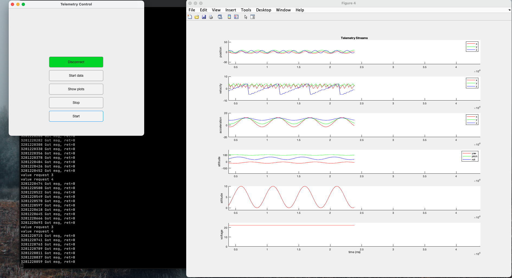

# TVC Hopper Flight Software

Initially designed to run on i.MX RTxxxx systems.
The project integrates well with MCUXpresso Config Tools to auto-generate low level configurations for peripherals and clocks (see `bsp`)
Being based on standard MCUXpresso IDE projects but reorganized and built with CMake enables easy integration with MCUXpresso tools
but also with custom tools, build needs, flashing, and testing.

## Building

### Dependencies

- `cmake` (>=3.17)
    Windows WSL users:
    ```
    $ sudo apt-get update
    $ sudo apt-get install apt-transport-https ca-certificates gnupg software-properties-common wget
    $ wget -O - https://apt.kitware.com/keys/kitware-archive-latest.asc 2>/dev/null | sudo apt-key add -
    $ sudo apt-add-repository 'deb https://apt.kitware.com/ubuntu/ bionic main'
    $ sudo apt-get update
    $ sudo apt-get install cmake
    ```
- `arm-none-eabi-gcc` (>=10.3.1)
- MCUXpresso Config Tools v12
- MCUXpresso IDE
- `catch2` (v3)
    ```
    $ git clone https://github.com/catchorg/Catch2.git
    $ cd Catch2
    $ cmake -Bbuild -H. -DBUILD_TESTING=OFF
    $ sudo cmake --build build/ --target install
    ```
- `ninja` (`sudo apt install ninja-build` or `pip install ninja`)

For Windows users, it is recommended to set up WSL for this toolchain.

### Programming and Debugging

#### Debugging

Currently, only the debug target is supported for the development board. Hopefully adding other support later.

To debug, use MCUXpresso IDE to open the project located at `support/tvc_ide_build` and use the `tvc_debug` target.
This target should be configured with the relative path to `build-debug/hopper.elf` if the project is cloned using git.
Build the project using the regular command line interface (`make debug`) to generate `hopper.elf`.
Debug as normal using the IDE's GDB interface.

This will be the normal method of debugging and testing you'll use on the System on a Board.

When connecting the development board, MCUXpresso sometimes has issues connecting if the board is connected before
the IDE is launched. For a most reproducible and consistent environment, launch the IDE first.

#### Programming Flight Controller

TBD. This may be difficult to get working.

### Build targets

The build supports 3 different targets:

- Debug: loaded to RAM, with debug symbols
- Release: loaded to RAM, no debug symbols
- FlexSPI NOR flash debug: loaded to external flash memory, with debug symbols
- FlexSPI NOR flash release: loaded to external flash memory, no debug symols
- Tests: build and run tests


### `make` targets

- `clean`: remove all build artifacts
- `debug`: debug build
- `release`: release build
- `flexspi_nor_debug`: debug build for flexspi nor flash
- `flexspi_nor_release`: release build for flexspi nor flash
- `test`: build and run unit tests
- `generate_spp_headers`: regenerate or update SPP property lists in various directories
- `telemetry_server`: build telemetry server
- `telemetry_emulator`: build telemetry emulator for testing
- `start_telemetry_server`: starts telemetry server
- `start_telemetry_emulator`: starts telemetry emulator (start from different terminal)


## Design and Architecture

### SPP - Simple Property Protocol

Key-value pair protocol taken from a different project. The client (the hopper) has a property list (names, ids, types, size, etc.) that
it can send to a host upon connection. Once connected, the host makes read and write requests to get and set property values.

Its interface is simple, an initialization function, a function to parse incoming messages, and a callback used to send messages.

Additionally, it uses two callbacks to get and set property values. These are simple and take a property id, a byte buffer, and size.
The callbacks use the property id to call a specific module's getter or setter for the value.

In practice, the callback to send a message simply calls the STCP write function to handle packet framing.

Property list generation is handled using an automated python script. The property list is defined in a TOML file in the support directory
and then the python script generates a pair of header and source files with the property list.

### STCP - Simple Transport Control Protocol

Packet framing protocol taken from a different project. Takes a packet, adds a header, footer, and checksum. Escapes all header/footer characters
inside the packet body.

An even simpler interface with just a function to handle incoming messages, a function to frame packets, and a callback to send messages.

### Circbuf - Circular Buffer

Library for a circular buffer. There's some work to be done here for making it more generic and usable but it'll work for now.

### Callbacks

In order to separate application level logic from the hardware and the operating system, layers interact with each other
using callbacks. For example, the file `src/app_hal_xconnect.c` contains the definitions of several callbacks which
connect the HAL functions to write to Xbee over UART with SPP. Additionally, the file will contain the interrupt definitions
to connect the incoming data with the appropriate packet parser.

## License

Some parts under MIT, some under GPLv3.

## Testing

Unit tests are run using Catch2, a standard C/C++ unit test framework.
The unit tests are focused on only testing the drivers and application code.

All tests are located in `tests` directory

### Telemetry Viewer

Start the server using `make start_telemetry_server mode=s`.
Use MATLAB, switch working directory to `tools/telemetry_viewer`. Run the script to plot incoming data.
To add new data, modify the server and the matlab script to accept and plot new values.

Unless using the telemetry emulator, the order of connections does not matter. The flight software, telemetry server, and telemetry viewer may be started in any sequence.
Additionally, the telemetry server can be restarted without needing to restart the flight software. Same is true for the flight software.

The telemetry server operates an SPP host instance that streams data from the client (either vehicle or emulated). The MATLAB visualization/viewer client connects to the server and reads data to plot.



#### Server API

- `id`: property id (2 bytes)
- `period`: period in milliseconds (4 bytes)
- `value`: property value (size bytes)

***Requests***

- `get/<id:2>`: Request property value from SPP client
- `val/<id:2>`: Request property value from telemetry server
- `str/<id:2><period:4>`: Start stream
- `set/<id:2><value:size>`: Set property value
- `emdat/<id:2><value:size>`: Provide emulated data

***Response***
- Value response: `<id:2><size:1><timestamp:4><value:size>`

#### Data emulation

Modify `tools/telemetry_emulator/src/main.cpp` to generate whatever telemetry data you'd like, may need to update property
lists.
Open a terminal and run `make telemetry_emulator start_telemetry_emulator`.
If starting the server with the emulator, use `make start_telemetry_server mode=e`

When using the emulator, the telemetry emulator must be started before the MATLAB viewer is launched.


